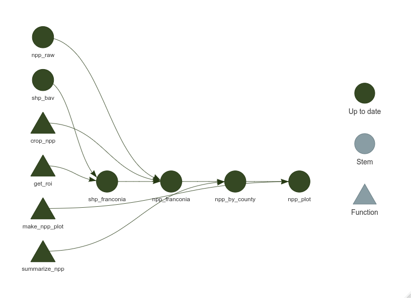

```{r setup, include=FALSE}
options(htmltools.dir.version = FALSE)
knitr::opts_chunk$set(
  fig.width=9, fig.height=3.5, fig.retina=3, 
  out.width = "100%",
  cache = FALSE,
  echo = TRUE,
  message = FALSE, 
  warning = FALSE,
  fig.show = TRUE,
  hiline = TRUE
)
```

```{r xaringan-themer, include=FALSE, warning=FALSE}
library(xaringanthemer)
style_duo_accent(
  primary_color = "#0065BD",
  secondary_color = "005293",
  inverse_header_color = "#FFFFFF"
)


xaringanExtra::use_editable()
xaringanExtra::use_tachyons()
xaringanExtra::use_panelset()
xaringanExtra::use_extra_styles()
```

## A "standard" workflow

- Idealized representation of a data-science type workflow ¹
- Starts with some set of raw data and ideally ends with communicable results  
- Your mileage may vary  


```{r echo = FALSE, fig.align='center', fig.retina=2, out.width = "70%"}
knitr::include_graphics("img/data-science.png")
```
.footnote[[1]https://r4ds.had.co.nz/explore-intro.html]

---
## The Myth of Sisyphus


```{r echo = FALSE, fig.align='center', fig.retina=2, out.width = "50%"}
knitr::include_graphics("img/data-science-explore.png")
```

```{r echo = FALSE, fig.align='center', fig.retina=2, out.width = "30%"}
knitr::include_graphics("img/Sisyphus-Overcoming-Silhouette.svg")
```

.footnote[[1] https://r4ds.had.co.nz/explore-intro.html, [2] https://wlandau.github.io/rpharma2020/]
---

## Potential Pitfalls

- Over successive iterations we lose track of changes we make
- We may have to devise a way to store or cache computationally expensive steps
- Can be difficult to come back to/get reacquainted with after some time
- Interactive session pollutes workspace
- Less than reproducible


.pull-left[.can-edit[
```{r import_data, eval=FALSE}
## Script to import the data
library(tidyverse)
climate_data <- 
  brick("data/CRUNCEP_EU_1901_2017.nc") %>%  
  rasterToPoints()
model_output <- 
  read_csv("data/cmass.out")
```

```{r model, eval=FALSE}
## Script to fit linear regressions
lin_reg_beech <- 
  lm(Fag_syl ~ precip, data_roi)

smr_lm <- summary(lin_reg_beech)

```

]]

.pull-right[.can-edit[

```{r wrangle, eval=FALSE}
## Script to wrangle data
source("import_data.R")

cmass_beech <- 
  select(c(Year, Lon, Lat, Fag_syl))
data_roi <- 
  left_join(cmass_beech, model_output)
```


```{r source_confusion, eval=FALSE}
## Script to visualize results
library(raster)
library(ggplot2)
library(lubridate)
source("build_model.R")
```
]]

---

## R Markdown

- Notebook type workflow (_see past presentations by Christian and Konstantin on Trello_)

- Offers some solutions: caching, forces linear structure, intertwined documentation


```{r markdown_img, echo=FALSE, out.extra='style="border-style: solid; border-color: #0065BD; border-radius: 3px; margin-left: auto; margin-right: auto; display: block"', out.width='60%', fig.align='right'}
knitr::include_graphics("img/markdown_example.png")
```

.center[
##**Does not always scale well!**
]


---
class:center middle

# {targets}
--


<a href="url">https://docs.ropensci.org/targets/</a>


---

## What is {targets}?
.bg-near-white.b--dark-blue.ba.bw1.br2[
>The `targets` package is a **Make-like pipeline toolkit** for statistics and data science in R. With targets, you can maintain a **reproducible workflow without repeating yourself**. `targets` **skips costly runtime** for tasks that are already up to date, runs the necessary computation with implicit parallel computing, and abstracts files as R objects. A fully up-to-date targets pipeline is **tangible evidence that the output aligns with the code and data**, which substantiates **trust in the results**.¹
]

### Key concepts

- analyses are structured as pipelines
- each intermediate step of a pipeline is a `'target'`
- each `'target'` is immutable 
- function-oriented programming style
- data / output files are automatically managed

.footnote[[1] https://docs.ropensci.org/targets/]

---

## Getting started
.panelset[.panel[.panel-name[Install and set up]
.pull-left[
- target script file *(`_targets.R`)* is required
- the rest of the file structure is largely up to the user
- Lends itself to use with R Projects in RStudio
]

.pull-right[.can-edit[
```{r, eval = FALSE}
├── _targets.R
├── R/
├──── functions.R
├── data/
└──── raw_data.csv
```
]]

```{r new_targets, eval=FALSE}
## From CRAN
install.packages("targets")
targets::tar_script() ## creates new target script in current working directory
targets::tar_edit() ## opens existing target script in current working directory
```

]
.panel[.panel-name[Target script skeleton]
.can-edit[
```{r ex_script, eval=FALSE}
library(targets)
# This is an example _targets.R file. Every
# {targets} pipeline needs one.
# Use tar_script() to create _targets.R and tar_edit()
# to open it again for editing.
# Then, run tar_make() to run the pipeline
# and tar_read(summary) to view the results.

# Define custom functions and other global objects.
# This is where you write source(\"R/functions.R\")
# if you keep your functions in external scripts.
summ <- function(dataset) {
  summarize(dataset, mean_x = mean(x))
}
# Set target-specific options such as packages.
tar_option_set(packages = "dplyr")
## End this file with a list of target objects.
list(
  tar_target(data, data.frame(x = sample.int(100), y = sample.int(100))),
  tar_target(summary, summ(data)) # Call your custom functions as needed.
)
```
]
]]
---

## Where to start?

**...and what to keep where**

--


.pull-left.b--dark-blue.ba.bw1.br2[
- use the _targets.R script as a high-level plan for the analysis workflow
  - each target calls a function
  - each important intermediate step becomes a target
  - isolate computationally costly steps

```{r tar, eval=FALSE}
tar_plan(
  tar_target(
    EU25_DEM,
    "eu_dem_v11_E40N20.nc",
    format = "file"
  ),
  tar_target(
    EU25_DEM_WGS84,
    dem_to_WGS84(EU25_DEM),
    format = "file"
  )
)
```
]

--
.pull-right.b--dark-blue.ba.bw1.br2[
- functions are kept in separate file(s) away from the _targets.R script
  - functions do the heavy lifting
  - matching function names and target names creates a tangible link between the abstracted plan and the actual code

```{r fun, eval=FALSE}
dem_to_WGS84 <- function(EU25_DEM) {
  gdalUtils::gdalwarp(
    EU25_DEM, tmp_name,
    t_srs = "EPSG:4326"
  )
  gdalUtils::gdal_translate(
    tmp_name, out_name, 
    of = "netCDF"
  )
  
  return(out_name)
}
```
]
---

## Why even bother?

- targets are cached once run
- {targets} keeps track of the dependencies between individual targets
- changes in functions or targets are are automatically detected and reflected in the dependency graph
.pull-left[
```{r, echo=FALSE}

```
]
.pull-right[
```{r, echo=FALSE}
knitr::include_graphics("img/tar_vis_out.png")
```
]

---

## How it works

####**1. Run the pipeline**

*`tar_make()`*
- run all (outdated) targets or specify which targets to run

####**2. Load targets to inspect**
*`tar_load()`*
- loads return value of the desired targets into the current environment
- loaded objects can be manipulated without affecting the pipeline and cache

####**3. Visualize pipeline**
*`tar_visnetwork()`*
- returns a dependency graph of the pipeline 
- can display metadata for each target

####**4. Rinse and repeat**

---

## Building targets

.pull-left[

**`tar_target()`**
- minimal target requires two arguments
- target name
- function call
]

.can-edit.pull-right[
```{r, eval=FALSE}
tar_target(
  name = first_target,
  command = first_function("path/to/data.nc")
)
```
]

--

.pull-left[
- additional arguments provide functionality for special cases
- `format` to specify how the output should be stored
  - can be used to keep track of files
- `cue` specifies when target should be (re)run
- `pattern` to specify iteration pattern
]

---

## What about R Markdown

- still valuable for communicating results
- `tar_render()` provides integration for .Rmd documents
- scaling and caching is handled by targets 
- code is largely isolated from markdown document to reduce clutter
  - only the last steps are done within markdown (i.E. plotting or simply loading targets)
  
.pull-left[
```{r, eval=FALSE}
   tar_target(
       npp_franconia,
       crop_npp(npp_raw, shp_franconia)
   ),
   
   tar_target(
       npp_by_county,
       summarize_npp(npp_franconia)
   ),
   
   tar_target(
       npp_plot,
       make_npp_plot(npp_by_county)
   ),

tar_render(slides, "doc/slides.Rmd")

```
]
.pull-right[
```{r, echo=FALSE}
knitr::include_graphics("img/tar_rmd.png")
```
]

---

## Further reading and useful links

Miles McBain: 
- **https://www.youtube.com/watch?v=jU1Zv21GvT4**
- **https://www.milesmcbain.com/posts/the-drake-post/**

*These cover drake, the predecessor to targets, but the concepts remain the same*

- **https://github.com/MilesMcBain/fnmate**
- **https://github.com/MilesMcBain/tflow**

*Two R packages which provide useful addins to be used with targets*

Will Landau: 
- **https://www.youtube.com/watch?v=Gqn7Xn4d5NI**
- **https://wlandau.github.io/posts/2020-12-14-targetopia/**
- **https://books.ropensci.org/targets/**

*Straight from the source; Will Landau is the author of targets*

